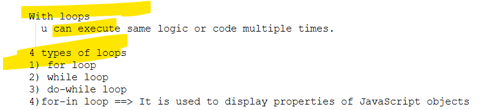
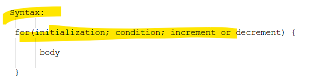
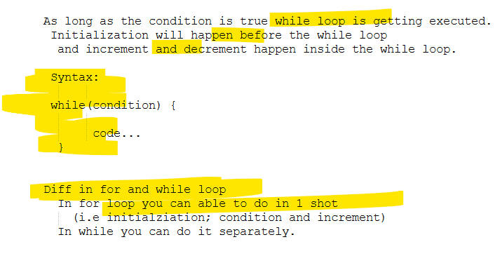
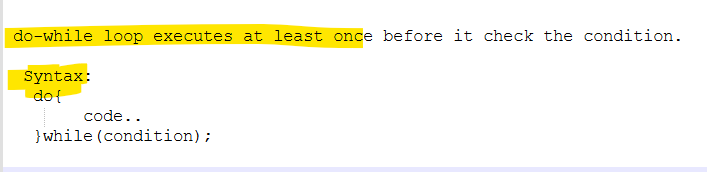
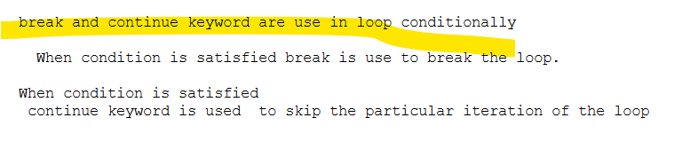
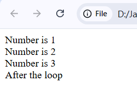
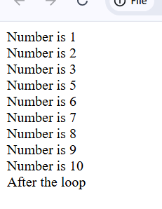
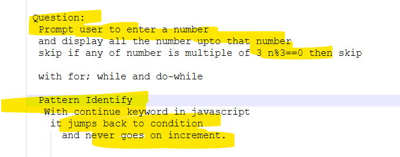

# 0) loop

# 1) for loop

## Q) Asked number from user and display it from 1 to that number?
```html
<html>
	<head>
		<title>loop</title>
		<script>			
		   
		   var n = parseInt(prompt("Enter a number")); 
		 
			for(var i=1; i<=n;i++){
				document.write("Number is  "+i+"<br/>");
			}
		</script>
    </head>
	
</html>
```
# 2) while loop

```html
<html>
	<head>
		<title>while loop</title>
		<script>			
		   
		   var n = parseInt(prompt("Enter a number")); 
		 
			var i = 1;
			while(i<=n){
				document.write("Number is  "+i+"<br/>");
				i++;
			}
		</script>
    </head>
	
</html>
```
# 3) do while loop

```html
<html>
	<head>
		<title>do while loop</title>
		<script>
			var i = 3;
			var n = 2;
			
			do{
				document.write("Value of i : "+i);
			}while(i<=n); /* Even though the condition is false but the loop executes atleast once*/
		</script>
    </head>
	
</html>
```
# 4) break and continue

## break
```html
<html>
	<head>
		<title>break And Continue</title>
		<script>			
		   
		   var n = 10; 
		 
			for(var i=1; i<=n;i++){
				
				if(i == 4){
					break;
				}
				document.write("Number is  "+i+"<br/>");
			}
			document.write("After the loop");
		</script>
    </head>
	
</html>
```

## Continue
```html
<html>
	<head>
		<title>Continue</title>
		<script>			
		   
		   var n = 10; 
		 
			for(var i=1; i<=n;i++){
				
				if(i == 4){
					continue;
				}
				document.write("Number is  "+i+"<br/>");
			}
			document.write("After the loop");
		</script>
    </head>
	
</html>
```

# Assginment

```html
<html>
	<head>
		<title>Assignment on loop</title>
		<script>			
		   
		   var n = parseInt(prompt("Enter a number")); 
			
		   document.write("Via for loop<br/>");
			for(var i=1; i<=n;i++){
				if(i%3==0){
					continue;
				}
				document.write("Number is  "+i+"<br/>");
			}
			document.write("End of for loop<br/><br/>");	
			
			
		document.write("Via while loop<br/>");
		   var j=1;
			while( j <= n){
			
			if(j % 3 == 0){
                j++;
                continue;
            }
				
				document.write("Number is  "+j+"<br/>");	
				j++;
			}
			document.write("End of while loop<br/><br/>");	
			
			document.write("Via do-while loop<br/>");
			var k=1;
			do{			
				
				if(k%3==0){
					k++;
					continue;
				}
				document.write(k+"<br/>");
				k++;
			}while(k <=n);
			document.write("End of do-while loop<br/><br/>");	
		</script>
    </head>
	
</html>
```
# ABC

