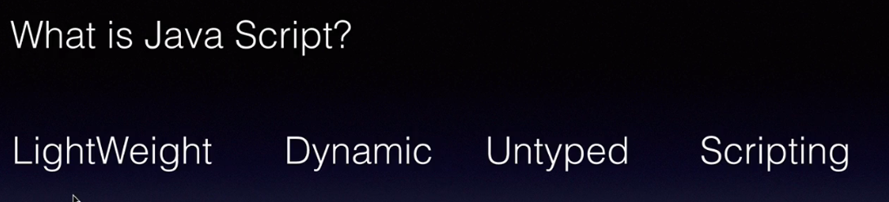
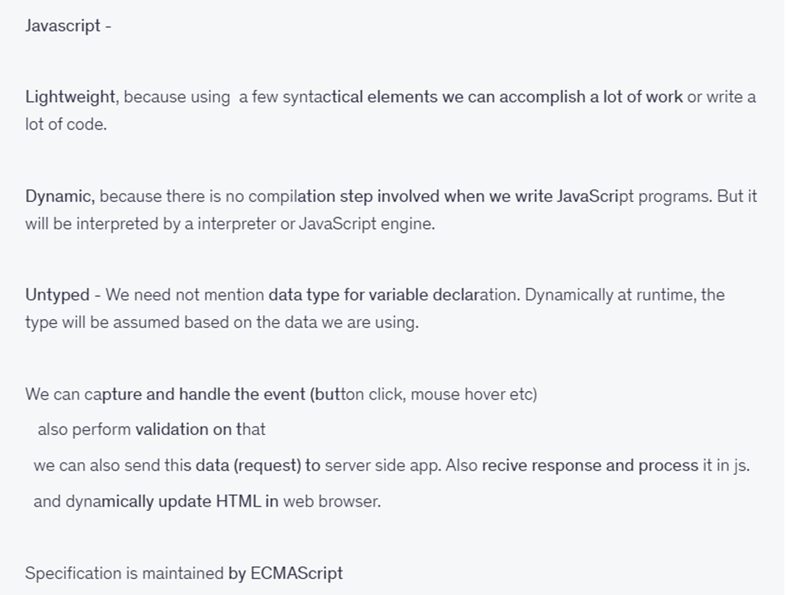
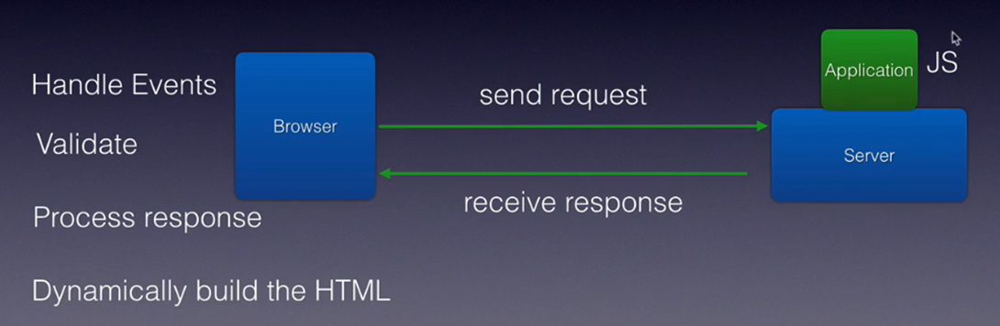
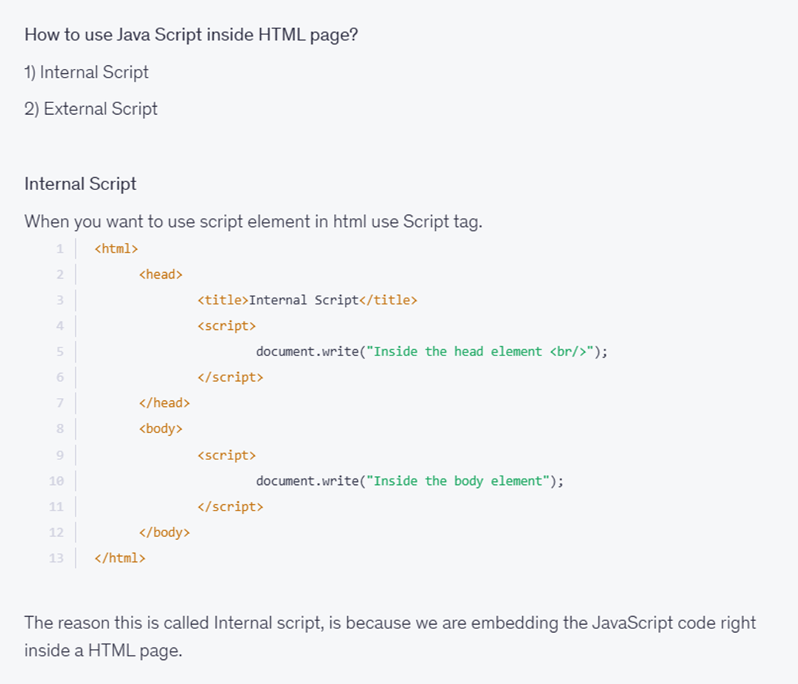
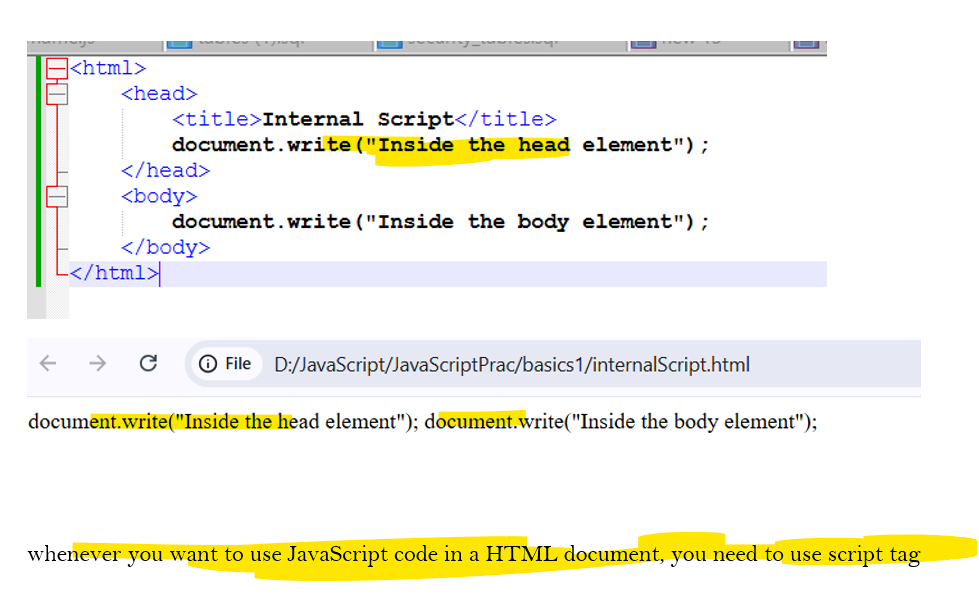
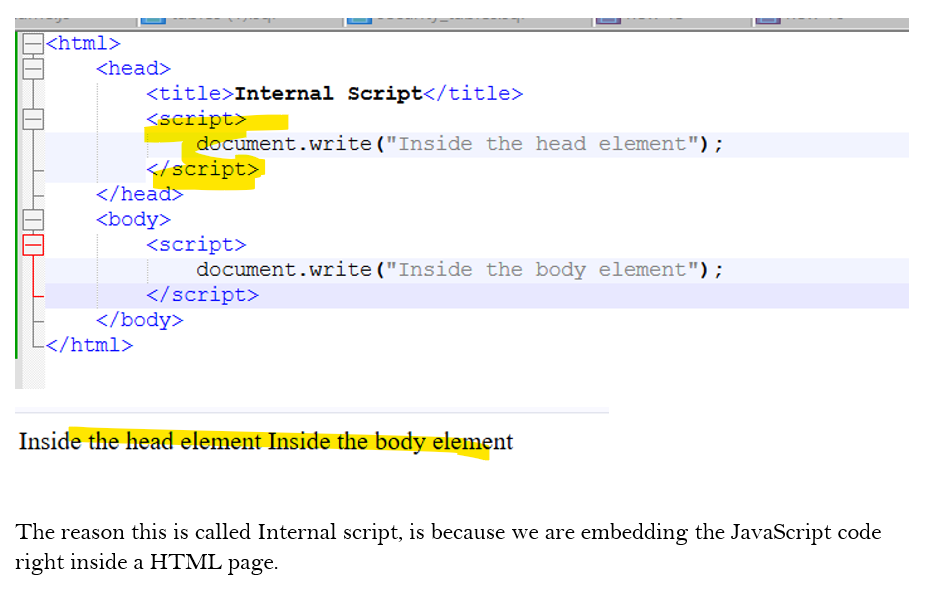

https://github.com/lionaditya/JavaScriptFundamentalByBharat.git
# Section-1: Introduction
# Section-2: JavaScript Basics
## What is JavaScript?

###  JavaScript Support both Functional and Object Oriented Principle.
## Create an internal Javascript?

```html
<html>
	<head>
		<title>Internal Script</title>
		<script>
			document.write("Inside the head element</br>");
		</script>
	</head>
	<body>
		<script>
			document.write("Inside the body element");
		</script>
	</body>
</html>
```