https://github.com/lionaditya/JavaScriptFundamentalByBharat.git
# Section-1: Introduction
# Section-2: JavaScript Basics
## What is JavaScript?

###  JavaScript Support both Functional and Object Oriented Principle.
## Create an internal Javascript?

```html
<html>
	<head>
		<title>Internal Script</title>
		<script>
			document.write("Inside the head element</br>");
		</script>
	</head>
	<body>
		<script>
			document.write("Inside the body element");
		</script>
	</body>
</html>
```
## Output
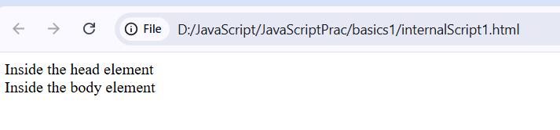
# 7 Document Object
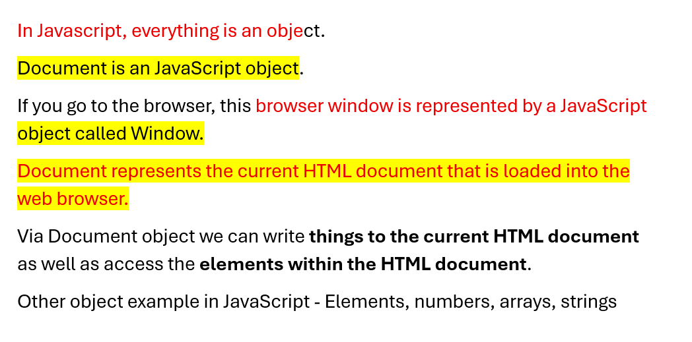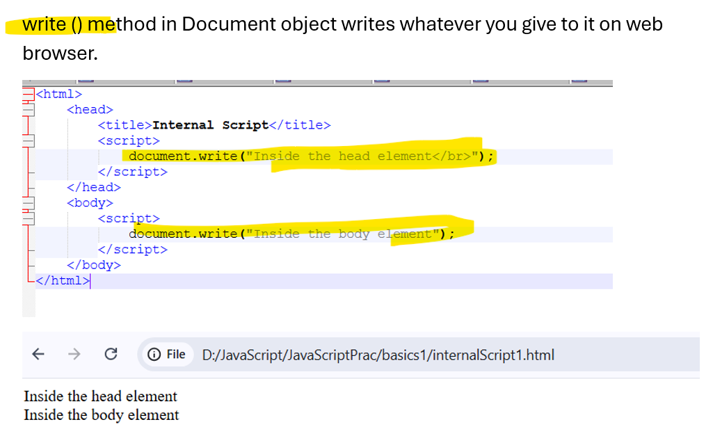
# 8. Commenting
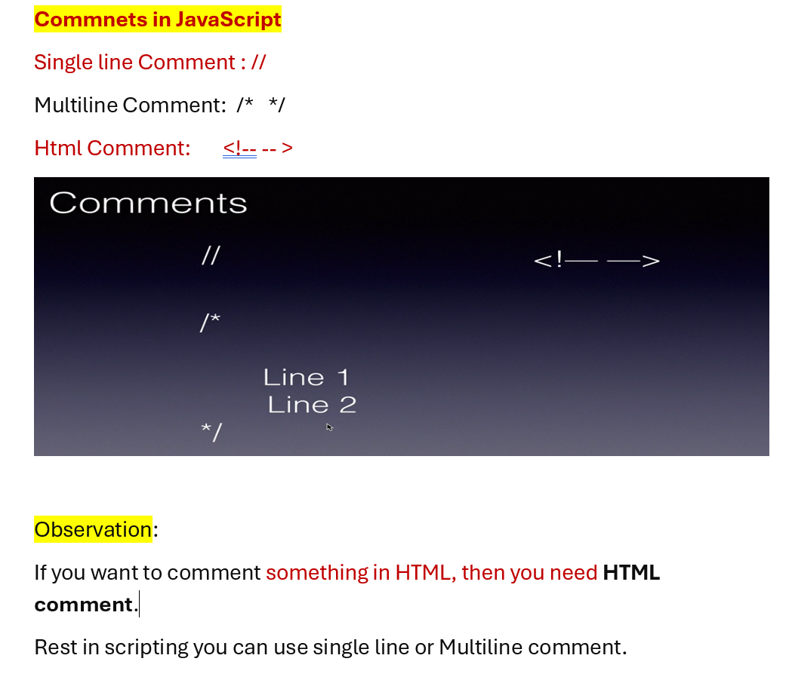
```html
<html>
	<head>
		<title>Comments</title>
		<script>
			//Single line comment
			//document.write("Inside the head element</br>");
		</script>
	</head>
	<body>
		<script>
		//Multiline comment
		/*
			document.write("Inside the body element");
			document.write("Line 2");
		*/
		</script>
		
		<!-- Using Html comments -->
		<!-- <b>Using Html comments</b> -->
	</body>
</html>
```
# 9. Create External JavaScript
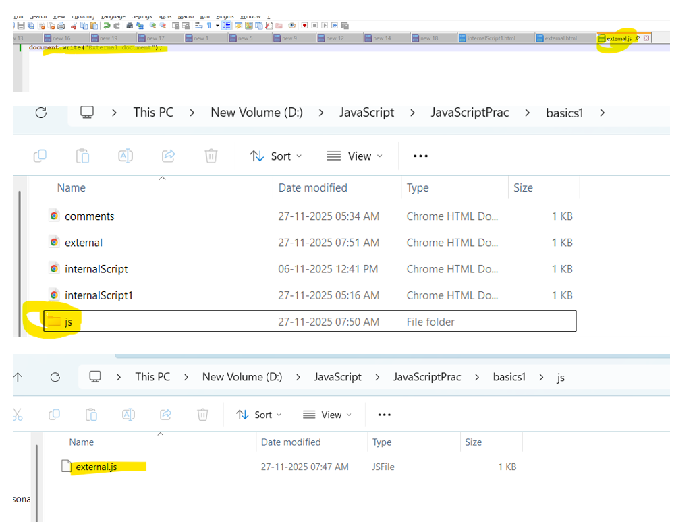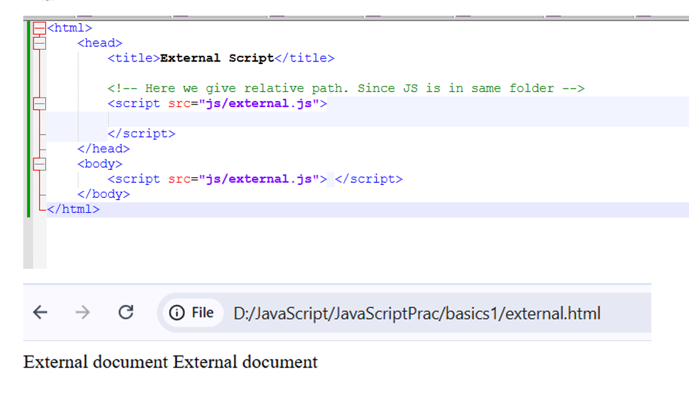
```html
<html>
	<head>
		<title>External Script</title>
		
		<!-- Here we give relative path. Since JS is in same folder -->
		<script src="js/external.js"> 
			
		</script>
	</head>
	<body>
		<script src="js/external.js"> </script>
	</body>
</html>
```
## external.js
```js
document.write("External document");
```
# 10. Using a Semicolon
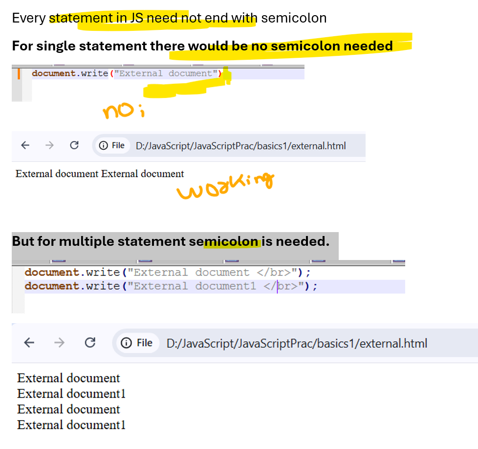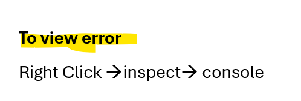
# 11. Checking for errors
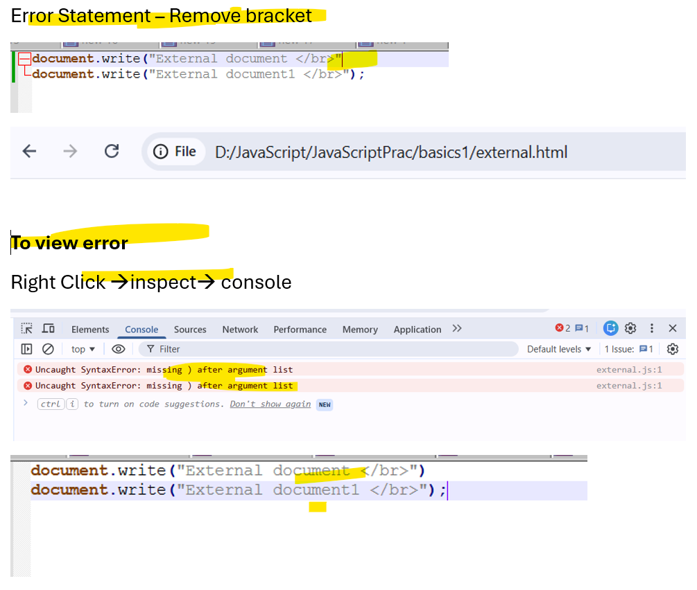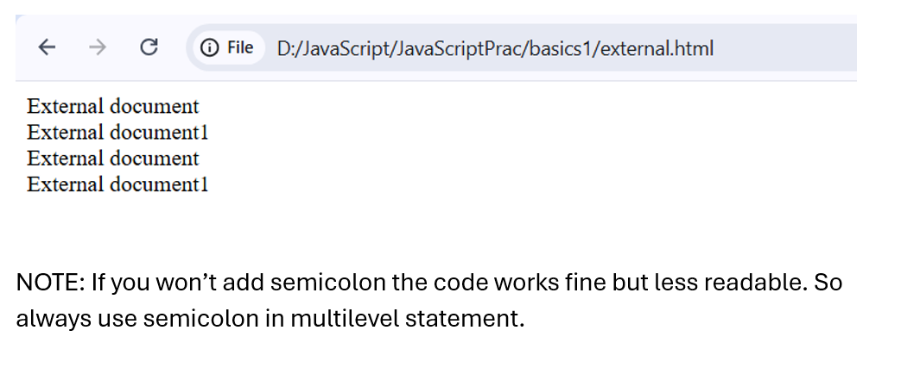
# Assignment
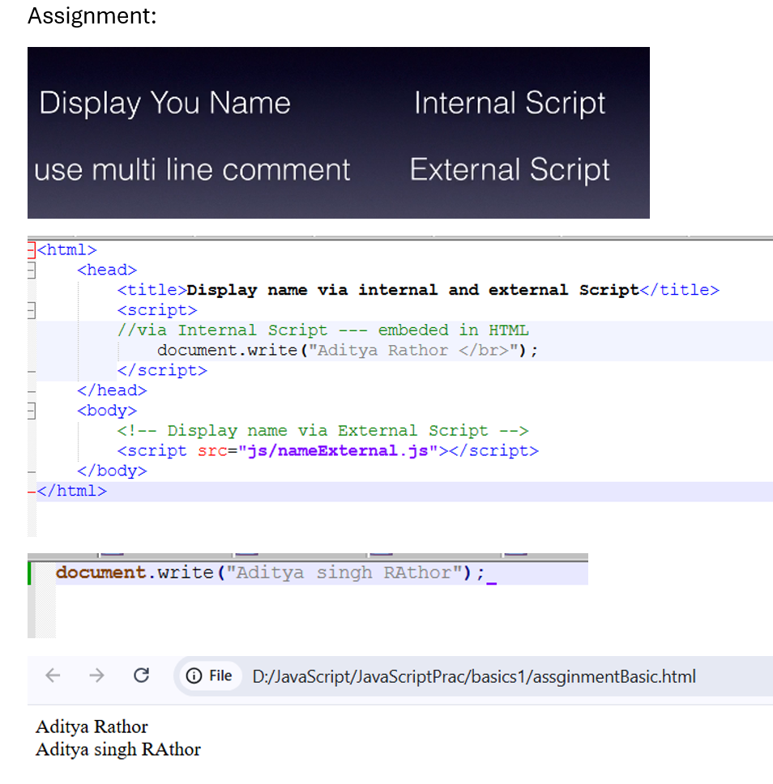