# ***Section-5: Conditional Statemen***
# 1) if Statement
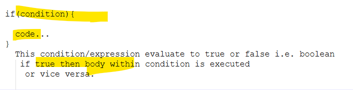
###
```html
<html>
	<head>
		<title>IF</title>
		<script>			
		   var x =  prompt("Please enter a number");		

           if(x == 10){
				document.write("x:"+x);
			}
		</script>
    </head>
	
</html>
```
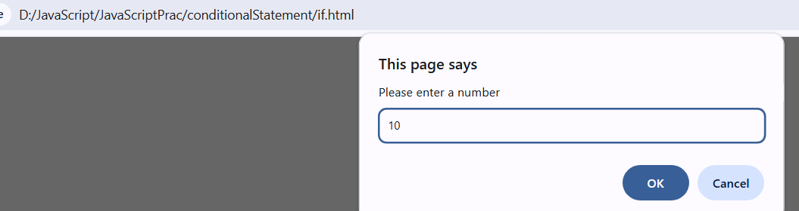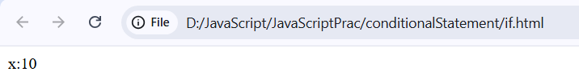
# 2) if else
```html
<html>
	<head>
		<title>IF</title>
		<script>			
		   var x =  prompt("Please enter a number");		

           if(x == 10){
				document.write("x:"+x);
			}else{
				document.write(" Else Block x:"+x);
			}
		</script>
    </head>
	
</html>
```
### Executing as expected
### We can also pass default value to prompt
```html
<html>
	<head>
		<title>IF</title>
		<script>			
		   var x =  prompt("Please enter a number","10");		

           if(x == 10){
				document.write("x:"+x);
			}else{
				document.write(" Else Block x:"+x);
			}
		</script>
    </head>
	
</html>
```
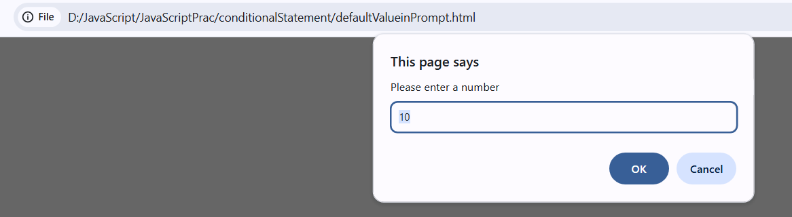
# 3) If else ladder
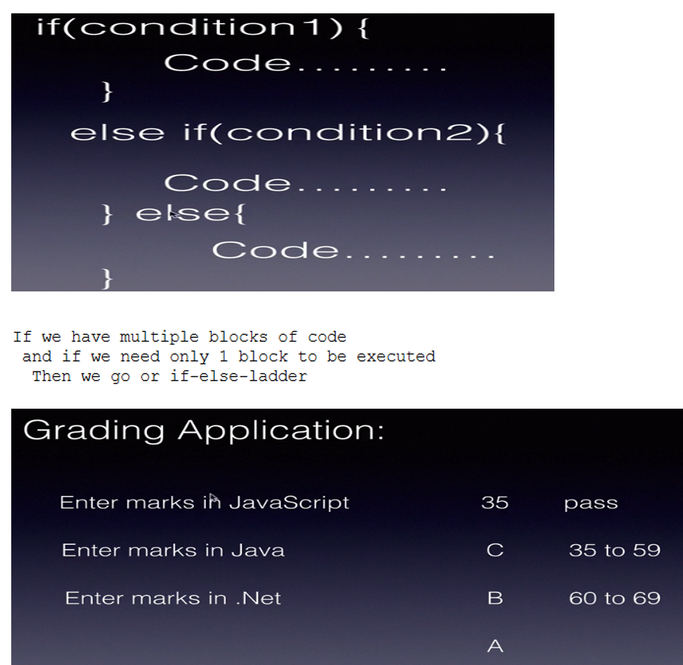
```html
<html>
	<head>
		<title>IF elseLadder</title>
		<script>		         	
		   var javaScriptMarks = parseInt(prompt("Please enter javaScript marks"));	    // Type Cast it since Marks is in int	
		   var javaMarks =  parseInt(prompt("Please enter Java marks"));
		   var dotNetMarks =  parseInt(prompt("Please enter .Net marks"));	

		// Calculate total
           var total = javaScriptMarks + javaMarks + dotNetMarks;		   
		   document.write("Total Marks : "+ total);
		   document.write("</br>");
		   
		//Calculate Averaage
		   var average = total/3;
		   document.write("Average : "+ average );
		   document.write("</br>");
		   
		   if(javaScriptMarks >= 35 && javaMarks >= 35 && dotNetMarks >= 35){
				
				document.write("Result : Passed");
				  document.write("</br>");
				if(average >= 35 && average <=59){
					document.write("Grade : C ");
				} else if(average >=60 && average < 70){
					document.write("Grade : B" );
				}else{
					document.write("Grade : A ");
				}
		   }else{
				document.write("Result : Fail");
		   }
		   
		</script>
    </head>
	
</html>
```
## Output as expected 
## Always check for && operator which is used for combining the multiple condition.
# 4) Logical Operator
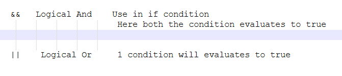
# 5) Switch 
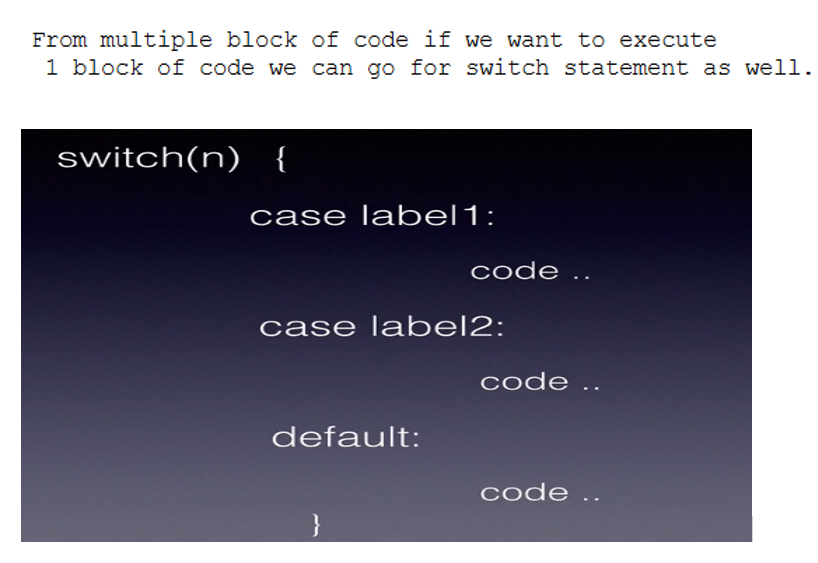
```html
<html>
	<head>
		<title>Switch</title>
		<script>			
		   
		      //From user take input 
			    // Also display default value so he can understand
		   var n = parseInt(prompt("Enter any number","1-3")); 
		   
		   switch(n){
				case 1: document.write("One");
				       break;
				case 2: document.write("Two");
				       break;			    
				default:
				     document.write("Three");
		   }
		</script>
    </head>
	
</html>
```
### Output as expected
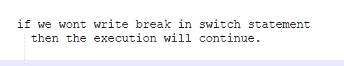
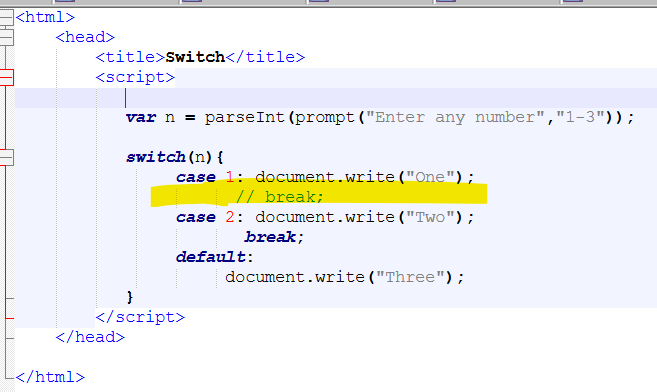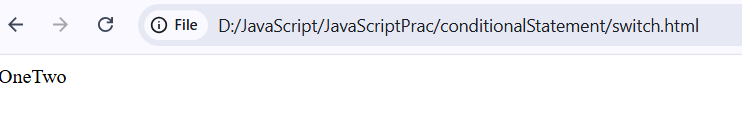
# 6) Switch with String
```html
<html>
	<head>
		<title>SwitchWithString</title>
		<script>			
		   
		   var n = prompt("Enter any name","john,bharat,mark"); 
		   
		   switch(n){
				case "john": document.write("john");
				           break;
				case "bharat": document.write("bharat");
				       break;		
                 case "mark": document.write("mark");
				       break;						   
				default:
				     document.write("No Match");
		   }
		</script>
    </head>
	
</html>
```
# 7) Assignment
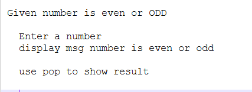
```html
<html>
	<head>
		<title>NumberEvenOrODD</title>
		<script>			
		   
		   var number = parseInt(prompt("Enter any number")); 
		   
		   if(number % 2 == 0){
				alert("Number is Even");
		   }else {
				alert("Number is ODD");
		   }
		</script>
    </head>
	
</html>
```
# ABC